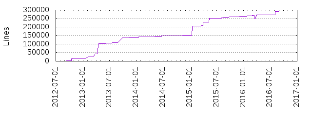
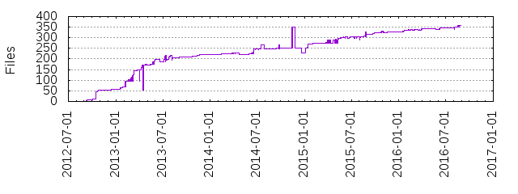
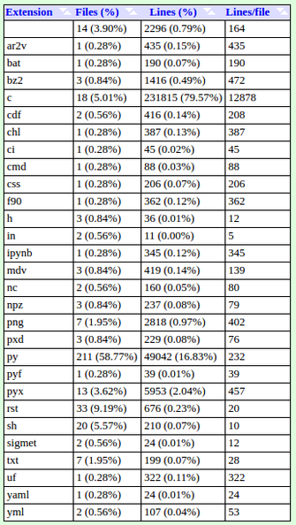

Py-ART Coding Statistics
========================

Since Py-ART's introduction, there have been a variety of different types of code and contributors present in its history to date. To have a better understanding of the details, a variety of statistics were generated using `GitStats <http://gitstats.sourceforge.net/>`_. These statistics offer insight on Py-ART's coding history, and by doing so, it is then possible to estimate potential future coding habits.

Lines of Code
=============

Py-ART to date, contains a total of 291,331 lines of code. During Py-ARTs 477 active days, 488,679 lines of code have been added and 197,348 lines of code have been removed.

Lines of Code Timeline
----------------------

        
Figure 1: Lines of codes created over time since Py-ART's creation.
     
Lines of Code by Author
-----------------------

To date, there have been 21 line contributers to Py-ART, the leads being Jonathan Helmus and Scott Collis. 

.. image:: ./images/lines_of_code_by_author.png

Figure 2: Lines of code created by authors over time.
   
File Types
==========

Py-ART is currently composed of 359 files created in 28 different file formats.

Figure 3: Files contained in Py-ART over time.
        
.py files have the highest presence with 211 (58.77%) of the files, however, .c composes a majority of Py-ART's line coding with 231,815 lines (79.57%) of the lines present. 

Figure 4: Breakdown of each filetype's frequency in Py-ART. 
