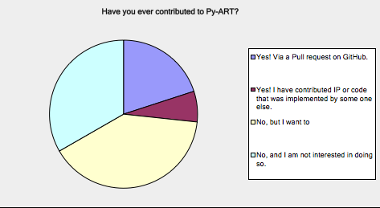

=========================================
Python ARM Radar Toolkit (Py-ART) Roadmap
=========================================

Introduction and Aims
=====================
About Py-ART and a history and what we want to do with this document 

   Figure 1: and image

The Py-ART Roadmap Survey
=========================
Description and methods and lots of images

User Use Cases
==============
Nesbitt group

meteo-swiss

Varble group

Overarching Goals for Next Five Years
=====================================
Freeform discussion of where we want to be

Priority Features
=================
In priority order the features we want added either by ARM or features that if
they are in a PR we will be very happy to help with this PR

