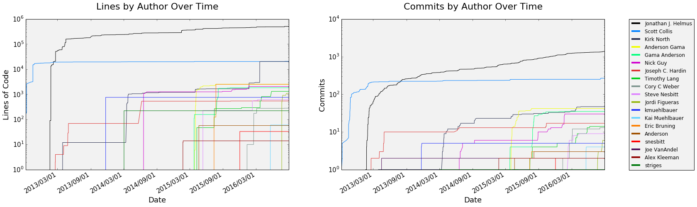

=========================================
Python ARM Radar Toolkit (Py-ART) Roadmap
=========================================
---------------------------------------------------------------
*Scott Collis, Cory Weber, Jonathan Helmus and Zachary Sherman*
---------------------------------------------------------------

Introduction and Aims
=====================
Everyone one who uses weather radar to do science uses, in one form or another,
radar software. Software is a science enabling piece of infrastructure and good
software minimizes frustration and allows the domain expert to get to 
understanding the phenomena being studied without needing to be an expert on
numerics, data informatics and software engineering.

There are several platforms for interacting with radar data, the open source
variants are well documented in (Heistermann et al 2014). The Python ARM Radar
Toolkit (Py-ART, Helmus and Collis, 2016) is one of these. 

Py-ART grew out of a collection of radar algorithms generated in support of the
new radar capability in the ARM program (Mather and Voyles, 2012). One of the
first contributions was a Linear Programming (LP) technique for separating
propagation polarimetric phase shift from other local impacts (Giangrande el at,
2013). As the collection of both algorithms and radars grew it became clear that
the problem would become intractable unless a carefully designed architecture was designed that allowed application chains to be developer via a common data model approach.

Shortly after, in early 2012 development on Py-ART began in earnest with the
support of the ARM program. In September of 2012 Py-ART was uploaded to the
social coding platform GitHub at https://github.com/ARM-DOE/pyart. Py-ART was
unofficially bumped to version 1.0.0-Dev in May of 2013 and publicly released.
The first "stable" release was 1.2.0 in February of 2015 and the most recent
release was 1.7.0 in September of 2016. Release notes can be found here: https://github.com/ARM-DOE/pyart/releases. 

   Figure 1: Lines of code by Contributor as a function of time. Note, some
   lines are automatically generated by Cython to C complilation.

Figure 1 shows the growth of the project as a function of time broken down by
contributor. Note that some of the code is C which has been generated by Cython
which inflates the number some what. 

Py-ART has benefited from code from 15 individual contributors. This has been
enabled by careful implementation of unit tests and continuous integration.
Every time a pull request is submitted against the Py-ART codebase a set of
tests run and a report is generated so the developers know if a contribution
causes any unit tests to fail. 

Py-ART receives vital support for accepting pull requests, bug fixing,
documentation, outreach and education through the ARM program which is part of
the Climate and Environmental Sciences Division of the Office of Science in the
Department of Energy. Due to this, and to ensure the toolkit has maximal impact
a roadmap to chart development priorities for the next five years is needed and
is the subject of this document. The roadmap document is broken down into:

1) This introduction

2) The results of the Py-ART roadmap survey

3) Proposed governance for accepting pull requests

4) Overarching goals for the next five years

5) Specific features that will be a priority for development

We also include a list of papers that have been accepted or are in process that
have made use of Py-ART as a reference at the end of this document. 

The Py-ART Roadmap Survey
=========================
In order to produce a development roadmap we first needed to get the views of
users and stakeholders as to what should be in the toolkit. To this end we
designed the Py-ART Roadmap survey. The survey was hosted on SurveyMonkey and we
got some much appreciated assistance from the ARM outreach office in editing some
questions for clarity. The Survey asked users to self identify as either a
Py-ART user or not and then asked if they would identify as:

1) A person who mainly works with observational data

2) A person who uses a mix of modelling and observational data

3) A person who mainly works with model data

Unfortunately we did not get a statistically significant enough sample to
discriminate between this groups so for this document *all user groups will be
combined* effectively giving two groups: those that do and do not use Py-ART.

The survey had 35 respondents which were solicited by the ARM and Py-ART mailing
lists, Facebook and Twitter. Of those 11 had never used Py-ART and 24 had. 

Respondents were presented with a list of possible additions to Py-ART's suite
of algorithms consisting of: Ingest of WRF data to the Py-ART grid model,
Cell/Object Tracking, Multi-Doppler wind retrievals, more bulk statistics of
grid or radar contents (CFAD, echo top heights etc..), easier "one step"
rainfall retrieval, more input formats, more output formats, more data quality
code (eg clutter rejection, biological masks..), velocity azimuth display wind
retrievals,

**METHODOLOGY OF THE RANKING:**

A selector dropdown ranks each feature between one and number of options.  
A count of the responses are multiplied against their ranked rank and summed. 
An example score would be three responses for rank 1 would be three points 4 
responses for rank 3 means 16 points added together 19 points.  That sum is 
divided by the total number of responses to that feature giving the feature a 
weighted ranked score, having the lowest score means that feature is the most 
important to the users. The example would yield a rank score of 2.7

Non Py-ART Users
----------------

**THE RESPONSE TO THE QUESTION "RANK THESE IN ORDER OF HOW LIKELY THEY ARE TO GET YOU INTERESTED IN USING PY-ART":**

1.  More high level retrievals from the literature (Eg DSD, Particle ID..)
2.  Multi-Doppler Winds
3.  Velocity Azimuth Display wind retrievals
4.  Easier "One step" rainfall retrievals
5.  Cell/Object Tracking
6.  Ability to handle Radar Spectra and perform retrievals on that
7.  More Bulk statistics of grid or radar contents (CFAD, echo top heights etc..)
8.  More output formats
9.  Quasi-Vertical Profile reconstruction from a list of radars
10. More input formats
11. Ingest of WRF data into the Py-ART Grid Model
12. More data quality code (eg clutter rejection, biological masks..)
13. Add the option of Cartopy map backend to the existing basemap in RadarMapDisplay

Py-ART Users
------------

**THE WEIGHTED RANKED ORDER OF FAVORITE FEATURE IS:**

1.  Plotting/visualization
2.  Diverse file format support
3.  Dealiasing
4.  Gridding include gridding of multiple radars
5.  As a dependency for CSU_Tools or ARTView or other
6.  Attenuation Correction
7.  Polarimetric phase processing processing (LP) (Tied with 8)
8.  Polarimetric phase processing processing (other) (Tied with 7)
9.  Knowing VAPS developed easily integrate with ADI/ARM systems

**REQUESTED FEATURES IN ORDER BY POPULARITY OF WEIGHTED RANK:**

1.  Multi-Doppler Winds
2.  Cell/Object Tracking
3.  More Bulk statistics of grid or radar contents (CFAD, echo top heights etc..)
4.  More output formats
5.  More input formats
6.  Velocity Azimuth Display wind retrievals
7.  Quasi-Vertical Profile reconstruction from a list of radars
8.  More data quality code (eg clutter rejection, biological masks..)
9.  Ingest of WRF data into the Py-ART Grid Model
10. Add the option of Cartopy map backend to the existing basemap in RadarMapDisplay
11. Easier "One step" rainfall retrievals
12. Ability to handle Radar Spectra and perform retrievals on that
13. More high level retrievals from the literature (Eg DSD, Particle ID..)

Proposed Governance Structure
=============================

Overarching Goals for Next Five Years
=====================================
Freeform discussion of where we want to be

Priority Features
=================
In priority order the features we want added either by ARM or features that if
they are in a PR we will be very happy to help with this PR

(Heistermann et al, 2104) Heistermann, M., Collis, S., Dixon, M.J., Giangrande, S., Helmus, J.J., Kelley, B., Koistinen, J., Michelson, D.B., Peura, M., Pfaff, T., Wolff, D.B., 2014. The Emergence of Open Source Software for the Weather Radar Community. Bull. Amer. Meteor. Soc. doi:10.1175/BAMS-D-13-00240.1

(Helmus and Collis, 2016) Helmus, J.J. & Collis, S.M., (2016). The Python ARM Radar Toolkit (Py-ART), a Library for Working with Weather Radar Data in the Python Programming Language. Journal of Open Research Software. 4(1), p.e25. DOI: http://doi.org/10.5334/jors.119

(Mather and Voyles, 2012) Mather, J.H., Voyles, J.W., 2012. The Arm Climate Research Facility: A Review of Structure and Capabilities. Bull. Amer. Meteor. Soc. 94, 377–392. doi:10.1175/BAMS-D-11-00218.1
 
(Giangrande et al, 2013) Giangrande, S.E., McGraw, R., Lei, L., 2013. An Application of Linear Programming to Polarimetric Radar Differential Phase Processing. Journal of Atmospheric and Oceanic Technology 30, 1716–1729. doi:10.1175/JTECH-D-12-00147.1

