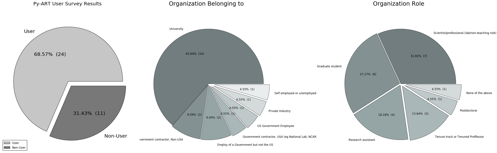
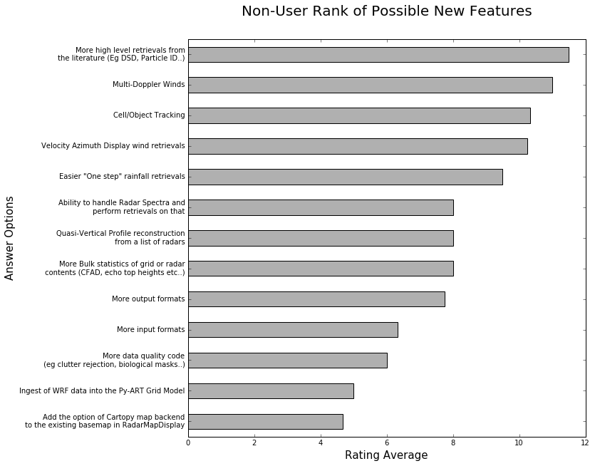
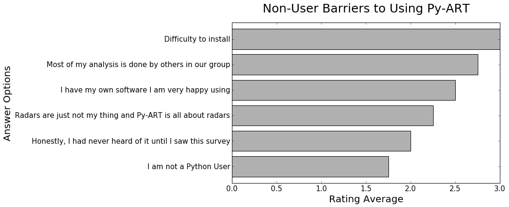
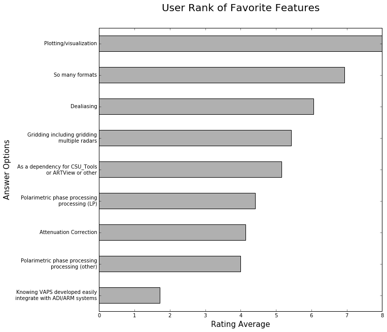
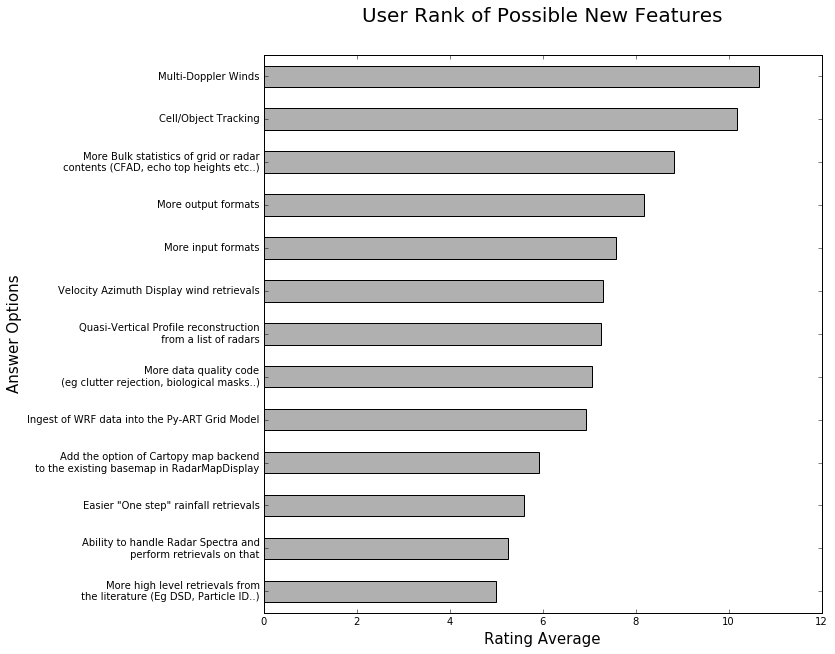
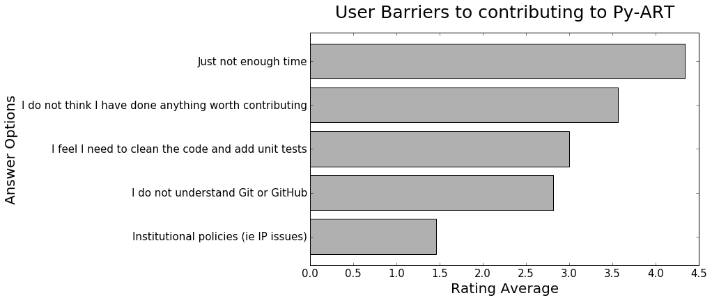
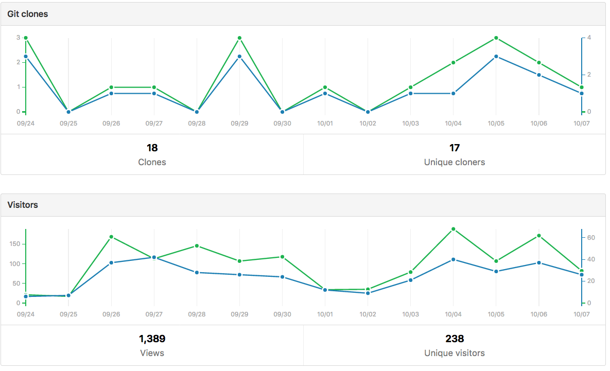

=========================================
Python ARM Radar Toolkit (Py-ART) Roadmap
=========================================
---------------------------------------------------------------
*Scott Collis, Cory Weber, Jonathan Helmus and Zachary Sherman*
---------------------------------------------------------------

1 Introduction and Aims
=======================
Radar software is key for producing scientific insight from radar data. There are 
several platforms for interacting with radar data; the open source
variants are well documented in (Heistermann et al 2014). The Python ARM Radar
Toolkit (Py-ART, Helmus and Collis, 2016) is one of these. **This document is a
guiding roadmap for development for Py-ART**. It sets priorities for ARM funded
work and it advises the community which contributions are desired and will
receive the most assistance from ARM funded software engineers. 

Py-ART grew out of a collection of radar algorithms generated to support the
new radar capability in the ARM program (Mather and Voyles, 2012). The two
original features were a Linear Programming (LP) technique for polarimetric phase processing (Giangrande el at,
2013) and mapping radar data onto a cartesian grid.

Shortly after, development on Py-ART began in earnest. ARM provided support specifically to release Py-ART open source.
In September of 2012, Py-ART was uploaded to the
social coding platform GitHub at https://github.com/ARM-DOE/pyart. Py-ART was
unofficially bumped to version 1.0.0-Dev in May of 2013 and publicly released.
The first "stable" release was 1.2.0 in February of 2015 and the most recent
release was 1.7.0 in September of 2016. Release notes can be found here: https://github.com/ARM-DOE/pyart/releases. 

.. figure:: ./images/lines_of_code_by_author.png
   :scale: 50 %
   :alt: an image

   Figure 1: Lines of code by Contributor as a function of time. Note, some
   lines are automatically generated by Cython to C complilation.

Figure 1 shows the growth of the project as a function of time broken down by
contributor. Note that some of the code is C which has been generated by Cython
which inflates the number slightly. 

Py-ART has benefited from code from 22 individual contributors. This has been
enabled by careful implementation of unit tests and continuous integration.
Every time a pull request is submitted against the Py-ART codebase a set of
tests run and a report is generated so the developers know if a contribution
causes any unit tests to fail. 

As the collection of algorithms and radars grew it became clear that, while
well meaning, third party contributions would subsume other ARM funded efforts
by the Py-ART development team.
Py-ART receives vital support for accepting pull requests, bug fixing,
documentation, outreach and education through the ARM program which is part of
the Climate and Environmental Sciences Division of the Office of Science in the
Department of Energy. Due to this, and to ensure the toolkit has maximal impact,
a roadmap to chart development priorities for the next five years is needed and
is the subject of this document. 

In summary, the roadmap will prioritize development over the next five years in five years
in the following areas:

1) Improved Quality Control (QC) codes allowing radar users to build better
application chains. 

2) Full support for the emerging Cartopy mapping engine ensuring sustainability
of Py-ARTs geospatial visualization tools.

3) Better Documentation, examples and a set of tutorials and courses to allow
easy delivery of learning using Py-ART.

4) An ingest of WRF produced NetCDF thus allowing efficient comparison between
model and radar produced fields. 

5) Work with a third party application to produce cell tracks. Support this
effort with visualizations. 

The details of these features is expanded on in sections 4 and 5. The roadmap document is broken down into:

1) This introduction

2) The results of the Py-ART roadmap survey and targeted reviews

3) Proposed governance for accepting pull requests

4) Overarching goals for the next five years

5) Specific features that will be a priority for development

6) Measuring impact and the success of the project

We also include a list of papers that have been accepted or are in process that
have made use of Py-ART as a reference at the end of this document. 

2 The Py-ART Roadmap Survey and Reviews.
========================================

2.1 The Survey
--------------

In order to produce a development roadmap, we first needed to get the views of
users and stakeholders as to what should be in the toolkit. To this end, we
designed the Py-ART Roadmap survey. The survey was hosted on SurveyMonkey and we
recieved some much appreciated assistance from the ARM outreach office in editing some
questions for clarity. The Survey asked users to self identify as either a
Py-ART user or not and then asked if they would identify as:

1) A person who mainly works with observational data.

2) A person who uses a mix of modelling and observational data.

3) A person who mainly works with model data.

Unfortunately, we did not get a statistically significant enough sample to
discriminate between these groups, so for this document *all user groups will be
combined* effectively giving two groups: those that do and do not use Py-ART.

The survey had 35 respondents which were solicited by the ARM and Py-ART mailing
lists, Facebook and Twitter. Of those 11 had never used Py-ART and 24 had. 

   
   Figure 2: Pie charts showing the split between Py-ART user and non-user
   respondants and aggregated (user/non-user) self identification of
   organization and role within that organization. 

Respondents were presented with a list of possible additions to Py-ART's suite
of algorithms consisting of: 

1) **Ingest of WRF data to the Py-ART grid model.** The ability to ingest WRF
out NetCDF files into the Py-ART Grid data model.

2) **Cell/Object Tracking.** The implementation of TITAN's cell tracking (Dixon
and Wiener, 1993) or similar to create cell tracks.

3) **Multi-Doppler wind retrievals.** Variational or other retrievals of
meridional, zonal, and vertical wind velocities from Doppler velocity
measurements. 

4) **More bulk statistics of grid or radar contents (CFAD, echo top heights etc..).** Functions 
that reduce radar volumes and grids down to descriptive parameters that could be visualized as a time series.

5) **Easier "one step" rainfall retrievals.** Making it
easier to simply go from a radar volume to a rainfall map.

6) **More output formats.**
More formats to write to.

7) **More input formats.** 
More ingests.

8) **Quasi-Vertical Profile reconstruction from a list of radars.** A specific
case of item 4 along the lines of (Ryzhkov et al, 2016).

9) **More data quality code (eg clutter rejection, biological masks..).** Code
to create gatefilters to remove non-meteorological echoes. 

10) **Add the option of Cartopy map backend to the existing basemap in RadarMapDisplay.** The ability 
to use the UK Metoffice developed Cartopy backend for map based displays. Cartopy is newer 
than the existing basemap backend but is likely to have a longer shelf life due to basemap 
not being supported beyond 2020. 

11) **Ability to handle Radar Spectra and perform retrievals on.** Extension of
the Py-ART data model to handle each gate having a spectra consisting of power
as a function of velocity or phase. This will allow for an extension into
spectra based retrievals such as clutter removal by interpolating over the "zero
peak".

12) **More high level retrievals from the literature (Eg DSD, Particle ID..).**
Systematic inclusion of various retrievals dealing with particle size retrieval
and rain/snow/hail/ice retrievals. 

13) **Velocity Azimuth Display wind retrievals.** Ability to retrieve flow
vectors as a function of height. Could include advanced techniques such as DVAD
(Lee et al, 2014). 

Respondents were only presented with the bolded text, the extra information
would have been excessive, but it could be assumed that familiarity may have
played some role in voting.

**METHODOLOGY OF THE RANKING:**

A selector drop-down ranks each feature between one and number of options.  
A count of the responses are multiplied against their ranked rank and summed. 
An example score would be 3 responses for rank 1 would be 3 points, 4 
responses for rank 3 means 12 points, then added together for 15 points. That sum is 
divided by the total number of responses to that feature giving the feature a 
weighted ranked score. Having the highest score means that feature is the most 
important to the users. The example would yield a rank score of 2.14

2.1.1 Non Py-ART Users
----------------------

Those who identified as non-users of Py-ART were asked "What feature would make
you more likely to use Py-ART." In advertising the survey we made a particular
effort to get respondents who do not use Py-ART so we did not suffer from an
"echo-chamber" effect. Figure 3 shows the results of this question. The most
popular weighted rank for new feature from non-users was "More high level
retrievals." The item relating to the mapping back-end Cartopy was
the least popular, unsurprisingly, since a fair assumption is many of the non-users are also
non-Python users and would not even know what Cartopy is. There is no real
sudden decrease anywhere along the rankings. 

   Figure 3: Average ratings for the question "How likely would these added
   features be to get you to use Py-ART?" aimed at non-users

The survey also asked about barriers that non-users faced to using Py-ART.
Figure 4 shows the weighted responses, surprisingly, the number one barrier was "Difficulty to install" followed by
"Most of my analysis is done by others in our group." The least popular barrier
was "I am not a python user," which is pleasing as it is indicative of a large
uptake of Python in the community. 

   Figure 4: Average ratings for the question "What is preventing you using
   Py-ART?"

2.1.2 Py-ART Users
------------------

With Py-ART users, in addition to asking what feature they desired, the survey
also asked them to identify their favourite feature. Figure 5 shows the weighted
rankings for the responses. Plotting/visualization was the most popular
feature closely followed by an appreciation for the wide variety of formats that
Py-ART can read. While unsurprising, this is in-line with the development
priorities of Py-ART to-date as the team sees the two biggest barriers to new
users of radar data being the reading of exotically formatted files and working
out what those files contain. Rankings decreased gradually with a notable break
when it came to "Knowing VAPS will work with ADI/ARM systems." Even though this
is one of Py-ART's primary aims (to enable PI developed data to integrate easily
with ARM systems), this is not surprising. If anything, the development team is a
victim of their own success in marketing Py-ART to the wider community. It does
show, however, we have some work to do in helping DoE funded PIs in using the
toolkit and advocating that funded retrievals be implemented in Py-ART. 

   Figure 5: Average rating for the question to users "What is your favourite
   feature of Py-ART?" 

Figure 6 shows the weighted ranks for desired new features for existing Py-ART
users. Figure 6 shows several key differences to figure 3. Multi-Doppler
retrievals is now the most popular feature, very closely followed by Cell
Tracking. And notably, more literature based techniques is the lowest desire by
existing users. Perhaps because many of them, using Py-ART's easy to use data
model, have implemented many of these techniques at their home institutions. 

   Figure 6: Average rating for the question to users "What features would you
   like to see added to Py-ART?" 

As well as having users pick from feature lists designed by the survey,
developers' free-form answers were solicited with the questions "what would be
Py-ART's Killer app." Users were allowed to enter three items each so they will
not all be documented here and are available in Appendix 1. The key take aways
are:

- Multi-Doppler retrievals are in high demand from the community. 

- A functionality that allows cross-sections through a radar volume between two
  points is desired. 

- Further desires for better dealiasing.

We took the opportunity to ask users about contributing. There were 18 responses to the question "Have you ever contributed to Py-ART?" Of the 18, 22.2%(4) said Yes via pull request through Github, 5.6%(1) said yes, by intellectual property implemented by someone else, 44.4%(8) said no, but they wanted to and 27%(5) said no and they were not interested in doing so.

Finally, we asked those who have not contributed what the barrier was to
contributing.

   Figure 7: Average ratings for the question "What is preventing you
   contributing to Py-ART?"

Figure 7 shows the average ranking with the most common barrier being "Just not
enough time." This is not surprising, as many researchers would not be judged
by open source contributions and would not value such in advancing their
careers. The second most common is "I do not think I have done anything worth
contributing." This is more than likely a misunderstanding as even things as
simple as correcting typographical errors in the documentation is a welcome
contribution and small changes are much easier to accept than more substantial
changes. The lowest ranking issue is to do with intellectual property issues.
This is pleasing, as it means there are few institutional roadblocks to our users
contributing.

2.2 Targeted Reviews
--------------------
Once the general community was polled and the first draft of this roadmap was
produced it was circulated to several key science users using two pathways: a
review coordinated by the chair of the ASR Radar Science group and a review
coordinated by the Py-ART Science lead. The former is a closed review the latter
is open although anonymous. 

2.2.1 Feedback from the Radar Science Group
-------------------------------------------
There were several key points raised in the collected responses from the Radar
Science Group:

- Py-ART is difficult to install for those not familiar with Python.
  
- There are existing retrieval algorithms for multi-Doppler. Since the
  methodology is non-trivial those wishing to peform this technique should work
  with the groups that designed these codes.

- Py-ART should do a better job at engaging the cloud radar community.
  

2.2.2 Feedback from ASR funded PIs
----------------------------------
The Py-ART science lead contacted four ASR funded PIs *who actively use Py-ART
in thier institutions*. These reviews were anonymous but the reviewers allowed
the reviews to be published openly [1]_. The results can be summarized as:

- Py-ART is time saving and a worthwhile activity by ARM.
- The Py-ART roadmap is generally on-point. With a few modifications.
- The ability to ingest WRF and other data into Py-ART's grid data model is
  desired.
- There should be a focus on basic corrections and QC. For example improving
  Doppler velocity Dealiasing and Phase Processing.
- Updating Py-ART to work with the new python mapping backend, Cartopy is both
  needed and a worthwhile effort.
- Multi-Doppler retrievals are desired by the community however Py-ART's
  strength of making the use of such retrievals so easy could lead to misuse of
  the technique. Such an endeavour would need to be done carefully.
- Both reviewers one and two believe Py-ART is not the place for simple grid
  statistics (CFADs) and retrievals (rainfall rate, particle ID). They should
  either be done by PIs or be in other open source toolkits such as
  CSU_radartools [4]. Reviewer four did not discuss this point much while
  reviewer three was in disagreement with reviewers one and two by stating it
  would be good to have Py-ART as a "one stop shop".

.. [1] https://github.com/ARM-DOE/pyart-roadmap/blob/master/reviews/concatinated_reviews.md

2.2.3 How the roadmap changed as a result of feedback
-----------------------------------------------------
As a result of feedback from the reviewers the current version of the roadmap
differers from the version that went out for review in the following ways:

- Work in QVPs, CFADs, et al ws de-emphasised. 
- Work on Multi-Doppler retrievals was significantly de-emphasised.
- A new item was added to the roadmap enabling ingest from WRF files to Py-ART's grid
  data model.
- The section on QC was expanded and highlighted as as a key priority.
- Note the support of Cartopy as a back end is a priority (2nd behind QC).
- Restrict development on handling radar spectra to the development of a data
  model.
- Added items regarding outreach, teaching and documentation. Specific focus on
  developing examples aimed at the cloud radar community. 

3 Proposed Governance Structure
===============================
The motivation of this roadmap is to ensure that the effort funded by the ARM
program is responsive to the needs of the stakeholders of the program. A large
task of the lead developer has been in assisting contributors in modifying pull
requests (contributions) so that they can be accepted into Py-ART. While it is
important to have a consistent standard across the codebase, many of the tasks
associated with accepting pull requests can be delegated to others in the
community. Currently, there are two ad-hoc defined roles in the Py-ART
project: Science Lead and Lead Developer. This roadmap proposes the
introduction of a third role: Associate Developer. The roles will be:

**Science Lead**: Provides high level leadership for the project, organizes outreach
and education, and coordinates contributor and stakeholder input to form a long
term vision for the project.

**Lead Developer**: Responsible for overall architecture of the project. Final
arbiter in what pull requests to accept. Develops the required style guidelines
and coordinates the associate developers. Coordinates contributions from
associated developers to a Contributors Guide (and contributes as well).  

**Associate Developers**: Responsible, as time allows, for doing an initial
check of pull requests for suitability and adherence to the Contributors Guide.
Contributes to the Contributors Guide. 

In seeking Associate Developers, it will be important to seek diversity to ensure 
there is no single point of failure in providing support to Py-ART. Ideally, the project would have 2-3 Associate Developers.
It will be expected that the associate developers will be recognized as key
members of the project and are acknowledged accordingly in future publications and
presentations. 

4 Overarching Goals for Next Five Years
=======================================
The aim of Py-ART is to lower barriers to doing science with radar data, in
particular for Department of Energy stakeholders. From the survey results it is
clear that there is a large demand for Multi-Doppler winds. However, on review
it was decided that due to the complexities of the retrievals this is better
left to a third party. Fortunately during the time of constructing the roadmap a
new package, Multi-Dop [2]_ was released. Therefore **the addition of
multi-Doppler capabilities will not be a priority in the roadmap.**

.. [2] https://github.com/nasa/MultiDop

The addition of Cartopy support polled well and was received well by the
reviewers. Fortuitously we recently accepted a pull request that enabled Cartopy
use with radial data. Therefore **the addition of Cartopy support for gridded
data and the improving of support for radial data will be a priority.** Pull
requests adding this capability will receive help from ARM developers. In five
years we expect to deprecate Basemap support and have fully functional Cartopy
based geospatial visualization capabilities. 

In the survey we asked the community about the addition of summary statistics
functions like  CFADs (Yueter and Houze 1995) and QVPs (Ryzhkov et al, 2016).
There was enough demand for it to be included in the first draft of the roadmap.
On review it was pointed out by multiple reviewers that these are very easy to
implement in Python by the users themselves and Py-ART would better serve the
community focusing on other areas. Therefore **pull requests dealing with
summary statistics will be treated as low priority. These contributions will
only recieve limited support from ARM funded developers.**

Cell tracking is an area that also polled well however on review it was decided
cell tracking is outside the scope of Py-ART. However there is an activity to
make cell tracking available within Python [3]_. Therefore **ARM support for
cell tracking as it relates to Py-ART will be limited to accepting pull requests
to integrate cell tracking *data* into Py-ART routines.** An example may be a
viewer allowing a moving frame of reference.

.. [3] https://github.com/openradar/TINT (under development)

The addition of a data model for radar spectra received moderate support from
polled stakeholders. However it reviewed very well with the Radar Science group
as a key way to engage the cloud radar community. Therefore **ARM developers
will prioritize helping a pull request submitted adding this capability.** If
resources are available ARM support may be made available to develop this
ourselves. 

The addition of an ingest of WRF data into Py-ART's grid model was not in the
stakeholder poll but was mentioned by multiple reviewers. This would be a nice
feature add for comparision between radar and model produced data. However it
sits right on the boundary of Py-ART's scope. Therefore **pull requests that are
nicely documented and require minimal developer time will be accepted.** 

Improving and expanding QC capabilities (dealiasing etc..) was not well defined
in the poll. However on review of the draft roadmap several users stated better
QC routines would *save significant time* in the reaching of scientific
conclusions from radar data. Therefore **pull requests improving or adding to
Py-ART's suite of QC routines will recieve the highest priority by ARM
developers.** This includes but is not limited to:

- The Linear Programming based phase retrieval technique (Giangrande et al 2013) 
  which has seen several improvements (Huang et al, 2017) and needs further automation 
- The attenuation correction code (Gu et al, 2011) also needs to be improved or
  replaced. 
- Py-ART would benefit from contributions dealing more with
  basic polarimetric quality control such as (Cao et al, 2016). 

Finally, in an oversight, the initial polling did not include a question on
documentation, examples and outreach. However this was strongly pointed out on
review. Furthermore discussions with maintainers of other major packages yield
the same information: *Many users would prefer to see more examples, and use
cases of existing features over new features*. Therefore **pull requests with
documentation, examples (cookbooks) recieve priority support from ARM
developers. A specific focus will be on engaging the cloud radar community.** 
Furthermore the Py-ART development team will continue to engage
the community by making training available at DoE and societal (AMS, AGU, ERAD,
EGU) meetings. Work will also be undertaken to construct a new repository
located on ARM's GitHub page [4]_ containing coursework and cookbooks. The
Py-ART team will engage with the cloud radar community to better understand
their workflows and replicate in Py-ART (with appropriate acknowledgement) as
examples. 

.. [4] https://github.com/ARM-DOE/

5 Priority features summary
===========================
The Development team will prioritize the acceptance of Pull requests and perform
targeted strategic development that adds
the following features:

5.1 Highest priority
--------------------

1) **Enhanced quality control features:** Clean up and improvement of existing 
   phase processing and attenuation correction code. New procedures for
   polarimetric QC. Improved velocity dealiasing and the detection of when this
   fails.

2) **Improved documentation, examples and training:** Better in-code
   documentation. Create a new repository with cookbooks that have "shovel
   ready" examples users can cut and paste. Continue to provide training at
   meetings and, where appropriate and cost effective, at institutions. A
   specific focus will be placed on engaging and increasing uptake amongst
   users of cloud radars. 

3) **Cartopy backend**: Extend the cartopy backend to the allow display of grid
   data. Improve radial data display.

5.2 Moderate priority
---------------------

4)  **Support for radar spectra**: A new data model and class pyart.core.radar_spectra 
    that allows the storage of spectra as a function of time and range gate. 

5.3 Lower priority (would be nice to have)
------------------------------------------

5) **Support for visualization of cell tracks:** Code that can accept a data
   frame of lat/lon data of storm cell location and plot these on Py-ART's
   display systems. An animated viewer that works in a moving frame of
   reference.

6) **Summary statistics:** Accept well documented, tested (ie very little effort
   from ARM) code that summarizes radar volumes and gridded data (eg  Statistical Coverage
   Product, May and Lane, 2009).

7) **WRF ingest:**  Accept well documented, tested (ie very little effort
   from ARM) code that ingests WRF produced NetCDF into Py-ART's grid data
   model. 

6 Measuring Impact
==================
As a Department of Energy Supported project it is important but not sufficient
to have a roadmap. It is important to monitor impact in order to justify
investment and measure the success of the roadmap. The impact of Py-ART can be measured three ways:

1) **Growing the number of users and installs**: While it is difficult to get exact
statistics, several Py-ART distribution channels provide information of how wide
spread the usage of the toolkit is. For example, figure 8 shows that the main
repository is viewed by over 100 unique visitors every week and installed 9
times. Success would mean growing this number. Truly metricing this aspect will
require periodic surveys. We recommend that surveys are carried out in at the
end of the 1st, 3rd, and 5th years of the roadmap. 

   Figure 8: Number of page views and clones (installs) of the main GitHub
   repository in a two week period. As the survey showed that the majority of
   installs are using Annaconda this graph represents a small fraction of the
   userbase. 

2) **Number and success of dependant projects**: Appendix 2 shows projects that
require Py-ART as a dependency. In order to be sustainable, Py-ART needs to have
a clearly defined scope and the needs of the community outside of this scope are better
served with new packages. Therefore, an increasing number and increasing
popularity of packages that depend on Py-ART are a measure of success.  

3) **Papers and presentations using Py-ART**: Publications are treated by many
user facilities as a metric of scientific impact. To date, in just over three 
years since it was first publicly released, Py-ART has been used in 10
publications. A rate of just over three per year. A metric of success will be to
grow this number. Py-ART includes a message on start up encouraging users to
acknowledge the ARM program and cite (Helmus and Collis, 2016). We will track
and record instances of this appearing in major journals and encourage (via the
Py-ART email list, Facebook page, and Twitter feed) users to self report so we
can build a Py-ART publications database.

Over the next five years, the success of this roadmap will be judged by more
users, a richer ecosystem of applications, and a large body of literature that
made use of the Python ARM Radar Toolkit. 

References
==========
(Heistermann et al, 2104) Heistermann, M., Collis, S., Dixon, M.J., Giangrande, S., Helmus, J.J., Kelley, B., Koistinen, J., Michelson, D.B., Peura, M., Pfaff, T., Wolff, D.B., 2014. The Emergence of Open Source Software for the Weather Radar Community. Bull. Amer. Meteor. Soc. doi:10.1175/BAMS-D-13-00240.1

(Helmus and Collis, 2016) Helmus, J.J. & Collis, S.M., (2016). The Python ARM Radar Toolkit (Py-ART), a Library for Working with Weather Radar Data in the Python Programming Language. Journal of Open Research Software. 4(1), p.e25. DOI: http://doi.org/10.5334/jors.119

(Mather and Voyles, 2012) Mather, J.H., Voyles, J.W., 2012. The Arm Climate Research Facility: A Review of Structure and Capabilities. Bull. Amer. Meteor. Soc. 94, 377–392. doi:10.1175/BAMS-D-11-00218.1
 
(Giangrande et al, 2013) Giangrande, S.E., McGraw, R., Lei, L., 2013. An Application of Linear Programming to Polarimetric Radar Differential Phase Processing. Journal of Atmospheric and Oceanic Technology 30, 1716–1729. doi:10.1175/JTECH-D-12-00147.1

(Huang et al, 2017) Huang, H., Zhang, G., Zhao, K., Giangrande, S.E., 2017. A Hybrid Method to Estimate Specific Differential Phase and Rainfall With Linear Programming and Physics Constraints. IEEE Transactions on Geoscience and Remote Sensing 55, 96–111. doi:10.1109/TGRS.2016.2596295

(Dixon and Wiener, 1993) Dixon, M., Wiener, G., 1993. TITAN: Thunderstorm Identification, Tracking, Analysis, and Nowcasting—A Radar-based Methodology. Journal of Atmospheric and Oceanic Technology 10, 785–797. doi:10.1175/1520-0426(1993)010<0785:TTITAA>2.0.CO;2

(Ryzhkov et al, 2016) Alexander Ryzhkov, Pengfei Zhang, Heather Reeves, Matthew Kumjian, Timo Tschallener, Silke Trömel, and Clemens Simmer, 2016: Quasi-Vertical Profiles—A New Way to Look at Polarimetric Radar Data. J. Atmos. Oceanic Technol., 33, 551–562, doi: 10.1175/JTECH-D-15-0020.1.

(Lee et al, 2014) Wen-Chau Lee, Xiaowen Tang, and Ben J.-D. Jou, 2014: Distance Velocity–Azimuth Display (DVAD)—New Interpretation and Analysis of Doppler Velocity. Mon. Wea. Rev., 142, 573–589, doi: 10.1175/MWR-D-13-00196.1.

(Yuter and Houze, 1995) Yuter, S.E., Houze, R.A., 1995. Three-Dimensional Kinematic and Microphysical Evolution of Florida Cumulonimbus. Part II: Frequency Distributions of Vertical Velocity, Reflectivity, and Differential Reflectivity. Monthly Weather Review 123, 1941–1963. doi:10.1175/1520-0493(1995)123<1941:TDKAME>2.0.CO;2

(May and Lane, 2009) May, P.T., Lane, T.P., 2009. A method for using weather radar data to test cloud resolving models. Met. Apps 16, 425–432. doi:10.1002/met.150

(Gu et al 2011) Gu, J.-Y., Ryzhkov, A., Zhang, P., Neilley, P., Knight, M., Wolf, B., Lee, D.-I., 2011. Polarimetric Attenuation Correction in Heavy Rain at C Band. J. Appl. Meteor. Climatol. 50, 39–58. doi:10.1175/2010JAMC2258.1

(Cao et al, 2016) Cao, Q., Knight, M., Ryzhkov, A.V., Zhang, P., III, N.E.L., 2016. Differential Phase Calibration of Linearly Polarized Weather Radars With Simultaneous Transmission/Reception for Estimation of Circular Depolarization Ratio. IEEE Transactions on Geoscience and Remote Sensing PP, 1–11. doi:10.1109/TGRS.2016.2609421

Appendix 1: Free form responses to "Killer App"
===============================================

These comments have no order to them so they are listed below for reference: 

Feature 1 (11 responses):

    Easier installation

    Dual-Doppler Wind Calculations

    More advanced feature with Cross-section cut, based on any two single points, similar to iris

    Dual-Doppler Winds

    Treat variable like this variable

    cross sections between any two points

    RadarCollection

    Advection correction

    More precise data model - e.g in Nexrad Level 3 the width of azimuth gates are not always uniform and in the data format the rays are described with "azimuth of the beginning of the ray" and width of the ray. See relevant ICDs on Level 3.

    Multi-Doppler wind retrievals

    Additional weighting function options when gridding radar data, besides the Barnes and Cressman schemes

Feature 2: (6 responses)

    Dealiasing X-Band Vertical Profiling Radar

    More advanced algorithm, like ZDR column detection or NCAR PID algorithms
    
    Easier Geotiff compatibility

    Carry along a map image/background to help speed up multiple plotting instances of same radar

    Improved dealiasing algorithms

    Hydro ID

    
Feature 3: (3 responses) 

    Collaboration with SingleDop 

    Improved dealiasing 

    Improvements to ARTview to make it replace solo3

Appendix 2: Packages that make use of Py-ART
============================================
**ARTView https://github.com/nguy/artview**
ARTview is an interactive GUI viewer that is built on top of the Py-ART toolkit. It allows one to easily scroll through a directory of weather radar data files and visualize the data. All file types available in Py-ART can be opened with the ARTview browser.

You can interact with data files through "Plugins". Many functions from the Py-ART package can be selected. In addition, ARTview plugins allow querying data by selecting regions or points visually.

**SingleDop https://github.com/nasa/SingleDop**
SingleDop is a software module, written in the Python programming language, that will retrieve two-dimensional low-level winds from either real or simulated Doppler radar data. It mimics the functionality of the algorithm described in the following reference:
- Xu et al., 2006: Background error covariance functions for vector wind analyses using Doppler-radar radial-velocity observations. Q. J. R. Meteorol. Soc., 132, 2887-2904.  

The interface is simplified to a single line of code in the end user's Python scripts, making implementation of the algorithm in their research analyses very easy. The software package also interfaces well with other open source radar packages, such as the [Python ARM Radar Toolkit (Py-ART)](https://github.com/ARM-DOE/pyart). Simple visualization (including vector and contour plots) and save/load routines (to preserve analysis results) are also provided.

**PyTDA https://github.com/nasa/PyTDA**
software providing Python functions that will estimate turbulence from Doppler radar data. It is tested and working under Python 2.7 and 3.4.

**DualPol https://github.com/nasa/DualPol**
This is an object-oriented Python module that facilitates precipitation retrievals (e.g., hydrometeor type, precipitation rate, precipitation mass, particle size distribution information) from polarimetric radar data. It leverages existing open source radar software packages to perform all-in-one QC and retrievals that are then easily visualized or saved using existing software.

**CSU Radar Tools https://github.com/CSU-Radarmet/CSU_RadarTools**
Python tools for polarimetric radar retrievals.

This codebase was developed at Colorado State University by numerous people, including Brenda Dolan, Brody Fuchs, Kyle Wiens, Rob Cifelli, Larry Carey, Timothy Lang, and others.

Currently, fuzzy-logic-based hydrometeor identification, blended rainfall, DSD retrievals, and liquid/ice mass calculations are supported. There is also an algorithm that uses a finite impulse response (FIR) filter to process differential phase and calculate specific differential phase. Finally, there are some tools to do rudimentary QC on the data.

Appendix 3: Papers in press that used Py-ART
============================================
[1] Shuyi S. Chen, Brandon W. Kerns, Nick Guy, David P. Jorgensen, Julien Delanoë, Nicolas Viltard, Christopher J. Zappa, Falko Judt, Chia-Ying Lee, and Ajda Savarin. Aircraft observations of dry air, the itcz, convective cloud systems, and cold pools in mjo during dynamo. Bulletin of the American Meteorological Society, 97(3):405-423, 2016. URL: http://dx.doi.org/10.1175/BAMS-D-13-00196.1, arXiv:http://dx.doi.org/10.1175/BAMS-D-13-00196.1, doi:10.1175/BAMS-D-13-00196.1.

[2] Scott E. Giangrande, Scott Collis, Adam K. Theisen, and Ali Tokay. Precipitation estimation from the arm distributed radar network during the mc3e campaign. Journal of Applied Meteorology and Climatology, 53(9):2130-2147, 2014. URL: http://dx.doi.org/10.1175/JAMC-D-13-0321.1, arXiv:http://dx.doi.org/10.1175/JAMC-D-13-0321.1, doi:10.1175/JAMC-D-13-0321.1.

[3] M. Heistermann, S. Collis, M. J. Dixon, S. Giangrande, J. J. Helmus, B. Kelley, J. Koistinen, D. B. Michelson, M. Peura, T. Pfaff, and D. B. Wolff. The emergence of open-source software for the weather radar community. Bulletin of the American Meteorological Society, 96(1):117-128, 2015. URL: http://dx.doi.org/10.1175/BAMS-D-13-00240.1, arXiv:http://dx.doi.org/10.1175/BAMS-D-13-00240.1, doi:10.1175/BAMS-D-13-00240.1.

[4] M. Heistermann, S. Collis, M. J. Dixon, J. J. Helmus, A. Henja, D. B. Michelson, and Thomas Pfaff. An open virtual machine for cross-platform weather radar science. Bulletin of the American Meteorological Society, 96(10):1641-1645, 2015. URL: http://dx.doi.org/10.1175/BAMS-D-14-00220.1, arXiv:http://dx.doi.org/10.1175/BAMS-D-14-00220.1, doi:10.1175/BAMS-D-14-00220.1.

[5] J. J. Helmus and S. M. Collis. The python arm radar toolkit (py-art), a library for working with weather radar data in the python programming language. Journal of Open Research Software, 4(1):e25, 2016. doi:10.5334/jors.119.

[6] M. P. Jensen, W. A. Petersen, A. Bansemer, N. Bharadwaj, L. D. Carey, D. J. Cecil, S. M. Collis, A. D. Del Genio, B. Dolan, J. Gerlach, S. E. Giangrande, A. Heymsfield, G. Heymsfield, P. Kollias, T. J. Lang, S. W. Nesbitt, A. Neumann, M. Poellot, S. A. Rutledge, M. Schwaller, A. Tokay, C. R. Williams, D. B. Wolff, S. Xie, and E. J. Zipser. The midlatitude continental convective clouds experiment (mc3e). Bulletin of the American Meteorological Society, 0(0):null, 0. URL: http://dx.doi.org/10.1175/BAMS-D-14-00228.1, arXiv:http://dx.doi.org/10.1175/BAMS-D-14-00228.1, doi:10.1175/BAMS-D-14-00228.1.

[7] Timothy J. Lang, Walter A. Lyons, Steven A. Cummer, Brody R. Fuchs, Brenda Dolan, Steven A. Rutledge, Paul Krehbiel, William Rison, Mark Stanley, and Thomas Ashcraft. Observations of two sprite-producing storms in colorado. Journal of Geophysical Research: Atmospheres, pages n/a-n/a, 2016. URL: http://dx.doi.org/10.1002/2016JD025299, doi:10.1002/2016JD025299.

[8] Harald Richter, Justin Peter, and Scott Collis. Analysis of a destructive wind storm on 16 november 2008 in brisbane, australia. Monthly Weather Review, 142(9):3038-3060, 2014. URL: http://dx.doi.org/10.1175/MWR-D-13-00405.1, arXiv:http://dx.doi.org/10.1175/MWR-D-13-00405.1, doi:10.1175/MWR-D-13-00405.1.

[9] Jingyin Tang and Corene J. Matyas. Fast playback framework for analysis of ground-based doppler radar observations using mapreduce technology. Journal of Atmospheric and Oceanic Technology, 33(4):621-634, 2016. URL: http://dx.doi.org/10.1175/JTECH-D-15-0118.1, arXiv:http://dx.doi.org/10.1175/JTECH-D-15-0118.1, doi:10.1175/JTECH-D-15-0118.1.

[10] Marcus van Lier-Walqui, Ann M. Fridlind, Andrew S. Ackerman, Scott Collis, Jonathan Helmus, Donald R. MacGorman, Kirk North, Pavlos Kollias, and Derek J. Posselt. On polarimetric radar signatures of deep convection for model evaluation: columns of specific differential phase observed during mc3e. Monthly Weather Review, 144(2):737-758, 2016. URL: http://dx.doi.org/10.1175/MWR-D-15-0100.1, arXiv:http://dx.doi.org/10.1175/MWR-D-15-0100.1, doi:10.1175/MWR-D-15-0100.1.

[11] Michael Hankey, Marc Fries, Rob Matson, Jeff Fries, AMSNEXRAD-Automated detection of meteorite strewnfields in doppler weather radar, Planetary and Space Science, Volume 143, 2017, Pages 199-202, ISSN 0032-0633, http://dx.doi.org/10.1016/j.pss.2017.02.008.

[12] Soderholm, J.S., H.A. McGowan, H.X. Richter, K. Walsh, T. Wedd, and T.M. Weckwerth, 0: Diurnal preconditioning of subtropical coastal convective storm environments. Mon. Wea. Rev., 0, https://doi.org/10.1175/MWR-D-16-0330.1

[13] Altube P, J Bech, O Argemí, T Rigo, N Pineda, S Collis, and J Helmus. 2017. "Correction of Dual-PRF Doppler Velocity Outliers in the Presence of Aliasing." Journal of Atmospheric and Oceanic Technology, , 10.1175/JTECH-D-16-0065.1. 

[14] Hoban NP. 2016. Observed Characteristics of Mesoscale Banding in Coastal Northeast U.S. Snow Storms. Ed. Masters Thesis. by Sandra Yuter (advisor), Raleigh, NC: North Carolina State University.

[15] Berkseth SM. 2016. Quantitative Analysis of the Turbulent Structure of Convection [Thesis]. Lubbock, TX: Texas Tech University.

[16] Mroz K, A Battaglia, TJ Lang, DJ Cecil, S Tanelli, and F Tridon. 2017. "Hail-Detection Algorithm for the GPM Core Satellite Sensors." Journal of Applied Meteorology and Climatology, , 10.1175/JAMC-D-16-0368.1. 

[17] North, K. W., Oue, M., Kollias, P., Giangrande, S. E., Collis, S. M., and Potvin, C. K.: Vertical air motion retrievals in deep convective clouds using the ARM scanning radar network in Oklahoma during MC3E, Atmos. Meas. Tech., 10, 2785-2806, https://doi.org/10.5194/amt-10-2785-2017, 2017.
